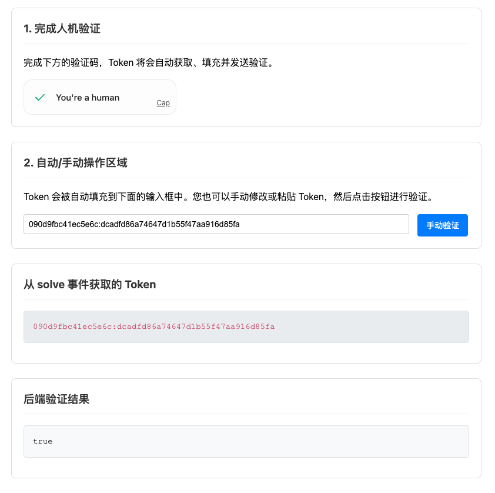

## 什么是 Cap Server Java?

Cap Server Java 是开源项目 [Cap](https://github.com/tiagorangel1/cap) 的 server，如你所见，这是一个 java 的版本。

代码参考了 [Cap](https://github.com/tiagorangel1/cap) 内置的 server 实现，提供了一个 CapServer 实例对外暴露服务，一共实现了三个方法

1. createChallenge：创建一个挑战
2. redeemChallenge：兑换挑战并返回一个临时凭证
3. validateToken：验证临时凭证

## 特点

- 提供  `cap-server-spring-boot-starter`  spring boot 启动器，开箱即用
- 扩展实现了基于 redis 缓存挑战以及临时访问凭证

## 结构介绍

```shell
cap-server-java
├── cap-server-bom                          bom 依赖管理
├── cap-server-core			                核心实现
├── cap-server-redis-spring-boot-starter	redis spring boot 启动器
├── cap-server-redis-store			        redis 存储扩展
├── cap-server-spring-boot-starter			cap server spring boot 启动器
└── cap-server-spring-boot-web-example	    使用案例
```

## 使用案例

#### 运行

`cap-server-spring-boot-web-example` 模块

你可以在你的电脑上运行 `cap-server-spring-boot-web-example` 模块，默认它将监听 `8080` 端口

当你在控制台看见 `Started CapServerWebApplication` 被输出时，意味着你能访问 `http://localhost:8080/api/index.html` 去测试 **Cap Server Java** 能否正常运行



#### 接入 redis

你需要将 **cap-server-java/cap-server-spring-boot-web-example/pom.xml** 的注释解开

```xml
        <!-- cap redis store starter -->
<!--        <dependency>-->
<!--            <groupId>top.wuhunyu.cap.server</groupId>-->
<!--            <artifactId>cap-server-redis-spring-boot-starter</artifactId>-->
<!--            <version>${cap-server.version}</version>-->
<!--        </dependency>-->
```

然后修改 **cap-server-java/cap-server-spring-boot-web-example/src/main/resources/redisson.yml** 中的 redis 配置为你自己的

重新启动即可

#### 修改配置

你也能修改一部分配置，比如**挑战数量**，**挑战难度**

通过修改如下 yaml 配置即可

```yaml
cap:
  server:
    # 挑战数量
    challenge-count: 50
    # 挑战大小
    challenge-size: 32
    # 挑战难度
    challenge-difficulty: 4
    # 挑战过期时间，单位：毫秒
    challenge-expires-ms: 600000
    # token 过期时间，单位：毫秒
    token-expires-ms: 1200000
    # id 大小
    id-size: 16
    # token 分隔符，一般为:，不需要修改
    token-key-splitter: ":"
```

每次项目启动时，都会打印这些配置信息

```shell
2025-06-17 19:10:19.714 [main] DEBUG t.w.c.server.autoconfigure.CapServerAutoConfigure - cap 属性配置: {tokenExpiresMs=1200000, challengeSize=32, idSize=16, challengeCount=50, challengeExpiresMs=600000, tokenKeySplitter=:, challengeDifficulty=4}
```

> 注意：但这部分配置不建议修改，你可以保持上面的配置不变，也可以完全不管它们。如果你没有主动配置这些属性，将会有默认值来填补它们